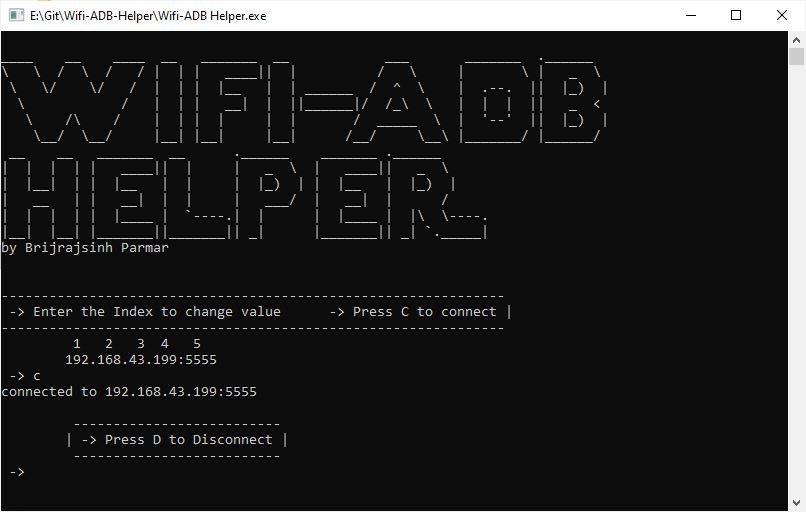

# Wifi-ADB-Helper
 

 
 
This tool is made to work in hand to hand with <b>Wifi ADB</b> app.

To reduce the hassel that comes working with command line on Wifi ADB this will help you by providing a easy to use semi-GUI interface to perform basic connection oriented tasks

# Where can i find Wifi Adb app?

here, https://play.google.com/store/apps/details?id=com.ttxapps.wifiadb

<i> p.s. you'll need root for that smh </i>

# What else can i use this tool for

anything that connects using an ip 🤷🏻‍♂️

# Inspiration

because me lazy